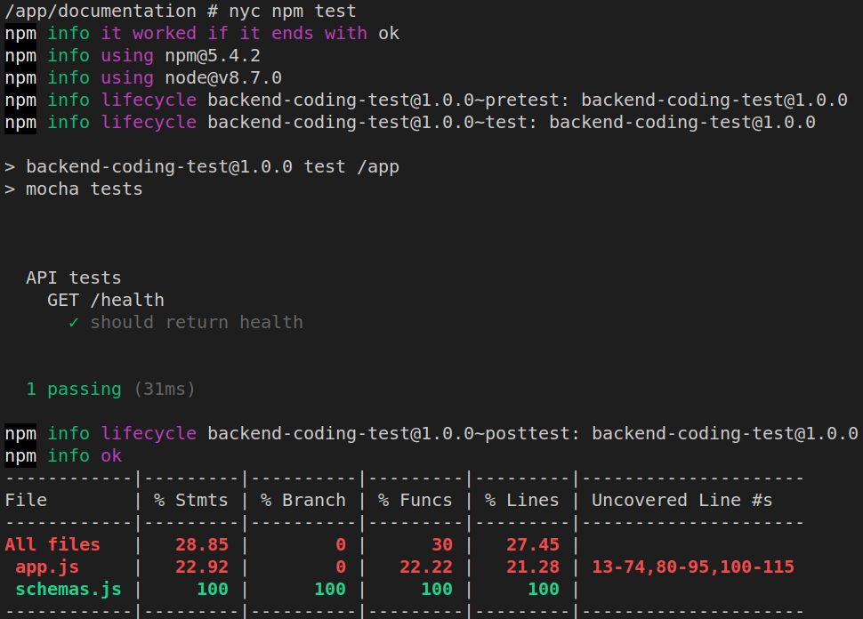
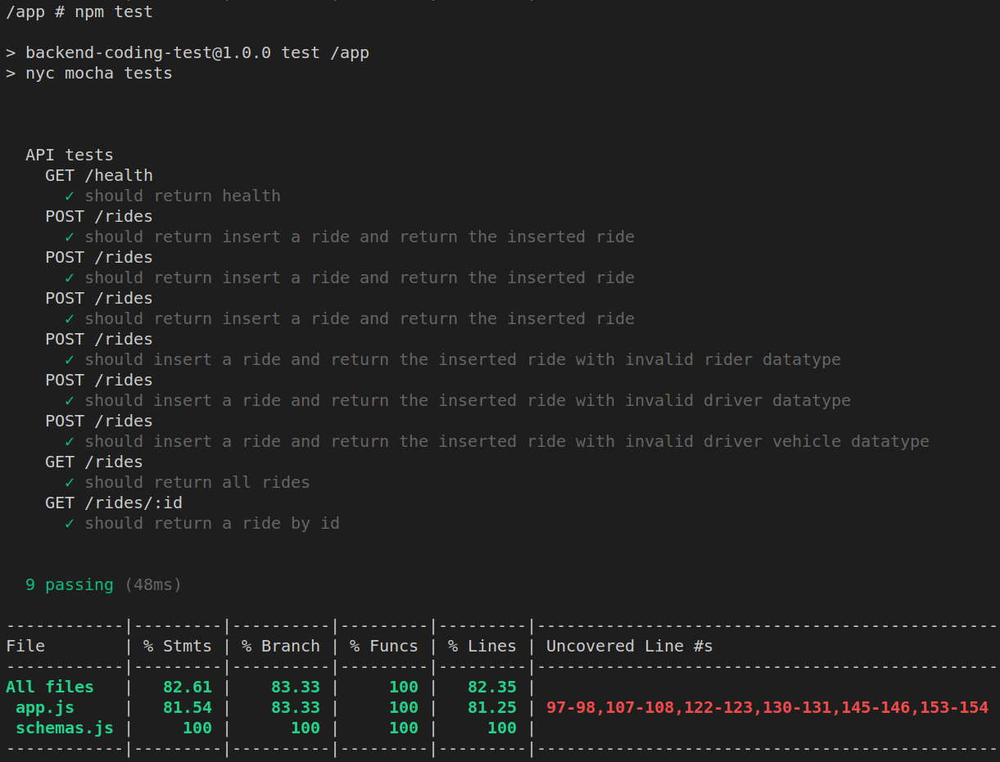
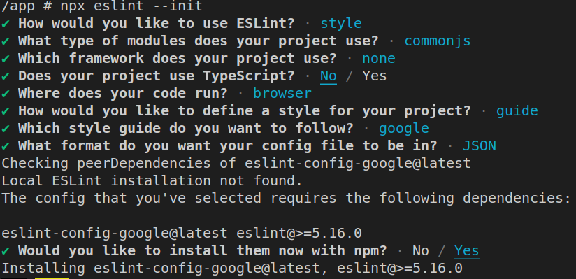
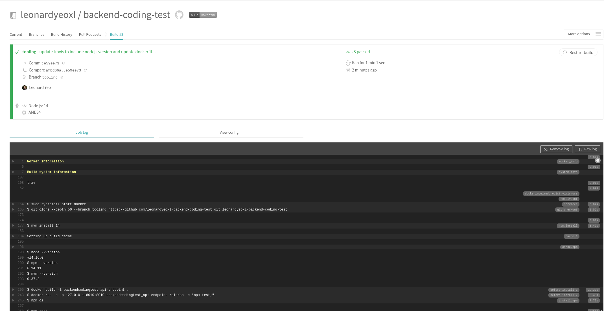
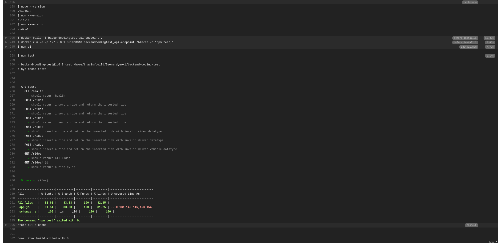

# Documentation

## NPM Packages

1. eslint@7.22.0
2. nyc@15.1.0
3. pre-push@0.1.1
4. winston@3.3.3
5. swagger-ui-express@4.1.6

## API Documentation Access

In container, run:
```sh
/app # npm start
```

Access API Documentation on `http://localhost:8010/api-docs/`

## Test Coverage

### 2021-03-25 (initial)



### 2021-03-25 (after improvement)



## EsLint Configuration



## Continous Integration

- Using Travis CI as continous integration


