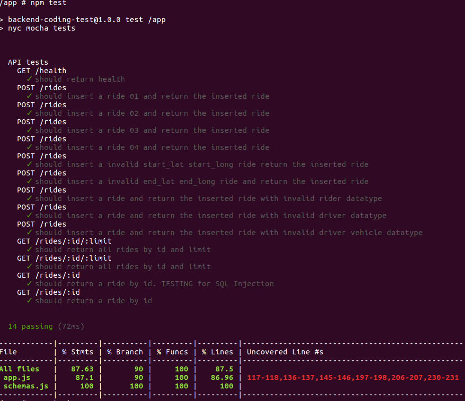
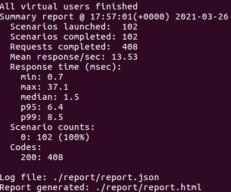

# Documentation

## Development Environment

- Host Operating System: Ubuntu 16.04
- Docker version 19.03.6, build 369ce74a3c
- Processor: 8 cores
- RAM: 16gb

## NPM Packages

1. eslint@7.22.0
2. nyc@15.1.0
3. pre-push@0.1.1
4. winston@3.3.3
5. swagger-ui-express@4.1.6

## Run container

```sh
~/backend-coding-test$ docker run -it -v `pwd`:/app/ -p 8010:8010/tcp backendcodingtest_api-endpoint:latest sh
/app # npm install
```

### Run Test

In container, run:
```sh
/app # npm test
```

## API Documentation Access

In container, run:
```sh
/app # npm start
```

Access API Documentation on `http://localhost:8010/api-docs/`

## Test Coverage

### 2021-03-25 (initial)


### 2021-03-25 (after improvement)


### 2021-03-27 (after improvement)



## EsLint Configuration


## Continous Integration

- Using Travis CI as continous integration


## Security

- Prepared statements to prevent/minimise SQL injection
- Add SSL/TLS on server

## Load Testing

### Instructions

1. Navigate to root directory
2. On the terminal, type `docker-compose build`
3. On the same terminal, type `docker-compose up` 

